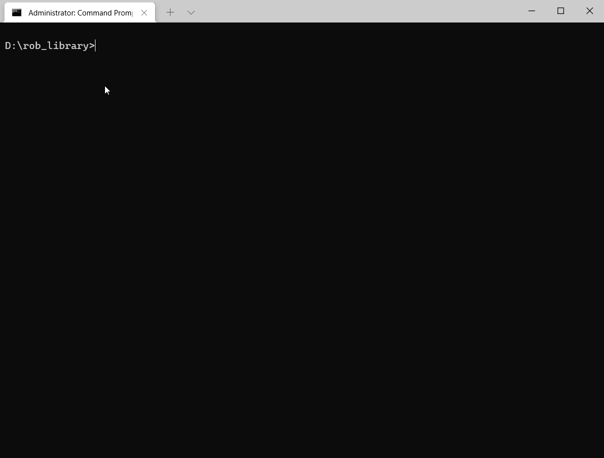
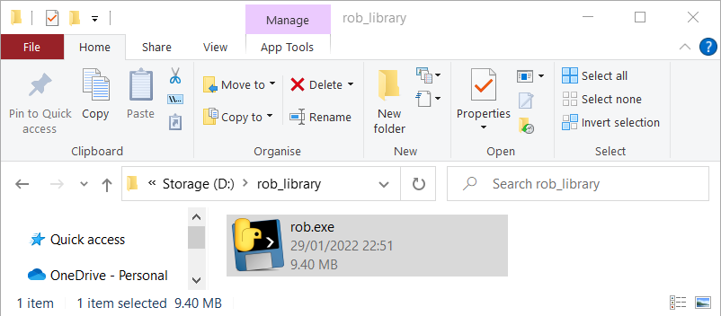
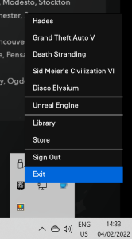
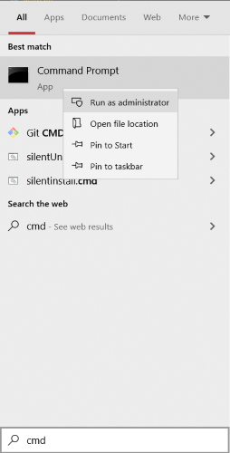
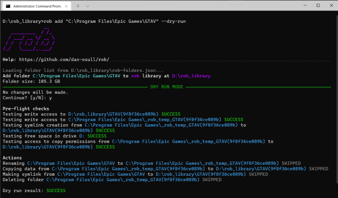
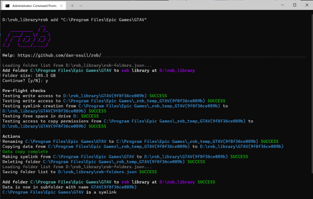
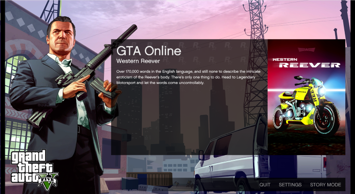
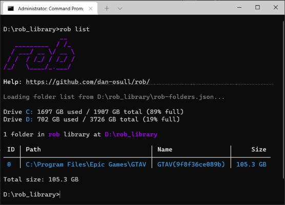

Is your SSD full of games that you don't want to delete?

Do you have a slow or metered internet connection and you can't download the same game multiple times?

**`rob` is a command line tool for Windows that frees up space on your SSD by moving game data to a library of folders on another disk.**

## Features

- 💾 Move any game to another disk
- 🕹 Games continue to update and run
- 👓 Transparent to games and app stores
- 💰 Free, open-source, no ads
- 🚀 Fast, multi-threaded data copy
- ✅ Test before you use with "dry run" mode
- 📈 Faster than downloading

## How?

`rob` creates a [symlink](https://en.wikipedia.org/wiki/Symbolic_link) from the original location to the library so that games continue to work and can be updated.

The process is reversible: `rob` can move a game back to your SSD on demand.

This means that you can have a game on your fast disk when you want to play it, then archive it when you're done. Less demanding games may even run well from your slower disk.

`rob` works by generating a new name for each folder, and storing the original path in a file named `rob-folders.json` in the `rob` library folder.

`rob` was designed with games and SSDs in mind but it works with folders and disks of any type.



> rob from the poor and give to the rich

## Download

- **[rob-0.2.0.zip](https://github.com/dan-osull/rob/releases/download/v0.2.0/rob-0.2.0.zip)** (9.2MB)

**This is a beta version.**

It should function well: `rob` is designed to be non-destructive, and it performs a lot of checks before moving data to ensure success. But it has not yet been used on a wide variety of systems "in the wild".

Please let me know how you get on at python@osull.com

## Example

### Add a folder to your `rob` library

In this example, I'm using `rob` to move GTA5 from a small fast SSD (drive C) to a big slow disk (drive D).

1. Create a folder on your big disk for your `rob` library. This will be the destination for data. I'm using **D:\rob_library**.

2. Download **[rob-0.2.0.zip](https://github.com/dan-osull/rob/releases/download/v0.2.0/rob-0.2.0.zip)**. Copy **rob.exe** from the ZIP file to your `rob` library folder.



3. Make sure that the game you're moving and its app store are not running. (Check the notification area/system tray in the bottom right of your screen.)



4. Search the Start menu for **cmd**. Right click the **Command Prompt** result and select **Run as Administrator**.



  *Hint: try [Windows Terminal](https://docs.microsoft.com/en-us/windows/terminal/install) for a more modern console experience*

5. In the command prompt, change directory to your `rob` library by entering:

       pushd "d:\rob_library"

6. Run `rob add` in dry run mode to check for any problems:

       rob add "C:\Program Files\Epic Games\GTAV" --dry-run

    Enclose paths that contain spaces in double quotes, as shown.



  *Hint: use a utility like [WinDirStat](https://windirstat.net/) to find the biggest folders on your SSD.*

7. Run the same command without `--dry-run` to move data for real:

       rob add "C:\Program Files\Epic Games\GTAV"

   It may take a while to copy data. It depends on the size of the folder and the speed of your drives.



8. Done! The game data is now stored in a subfolder of your `rob` library. The original path is a symlink. The game keeps working.



### Remove a folder from your `rob` library

In this example, I'm using `rob` to move GTA5 back to a small fast SSD (drive C).

1. Make sure that the game you're moving and its app store are not running. (Check the notification area/system tray in the bottom right of your screen.)

2. Search the Start menu for **cmd**. Right click the **Command Prompt** result and select **Run as Administrator**.

3. In the command prompt, change directory to your `rob` library by typing:

       pushd "d:\rob_library"

4. See what's in your `rob` library:

       rob list



5. Run `rob remove` in dry run mode to check for problems:

       rob remove "C:\Program Files\Epic Games\GTAV" --dry-run

   *Hint: you can also select a folder by providing its ID or Name.*

6. Run the same command without `--dry-run` to move data:

       rob remove "C:\Program Files\Epic Games\GTAV"

7. Done! The game data is back in its original location.

## Reference

```
               __
   _________  / /_
  / ___/ __ \/ __ \
 / /  / /_/ / /_/ /
/_/   \____/_.___/

Help: https://github.com/dan-osull/rob/

Usage: rob [OPTIONS] COMMAND [ARGS]...

  rob is a command line tool that frees up space on your SSD by moving data to
  a library of folders on another disk.

  rob creates a symlink from the original location to the library so that
  games continue to work and can be updated.

Options:
  -l, --library-folder DIRECTORY  The path of the library. The current folder
                                  is used by default.
  -h, --help                      Show this message and exit.

Commands:
  add     Add FOLDER_PATH to library
  list    List folders in library and their size
  remove  Remove FOLDER_PATH from library
```

Each command has further help, e.g. `rob add --help`

## Is this malware?

No. 

But the exe may give a false positive because this tool copies and deletes data.

If you get a false positive, you can either tell your security software to unblock/allow `rob`, or [install Python and run the code from there](#python-instructions).

## Can I trust you?

This software is open source and its code can be inspected to verify that it does what I say.

There are two ways to directly use the code in this repo:

1. [Run in Python](#python-instructions)
2. Make your own exe using `build_exe.cmd`

## Does `rob` need Administrator access?

In short: yes.

The long answer is that `rob` can work without admin access if:

1. You have enabled [Windows Developer Mode](https://docs.microsoft.com/en-us/windows/apps/get-started/enable-your-device-for-development), which lets normal users create symlinks.
2. You are not copying from a protected area of the operating system, like Program Files.
3. You run **rob add** with the **--dont-copy-permissions** flag, as you typically need admin access to set permissions. This could have negative implications for security.

Because `rob` is designed for games, which are usually in Program Files, in practice it is easiest to run the tool from an admin Command Prompt.

## Python instructions

Pythonistas can run `rob` as a Python package.

Download this repo and:

    pip install poetry
    poetry install
    poetry run python -m rob

Tested with Python 3.10, Windows installer, 64-bit.

## Thanks

This software is dedicated to Comcast, the worst company in the history of the world.

## Feedback

Please drop me a line at python@osull.com
